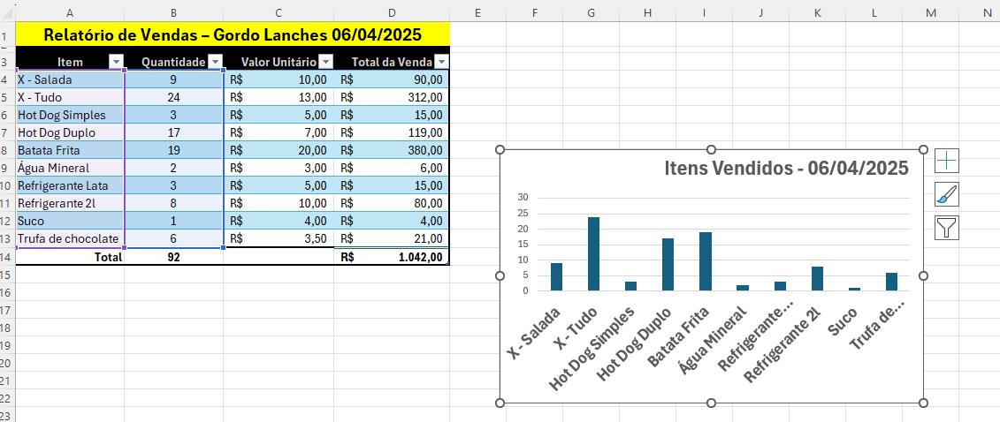

# Gordo Lanches – Relatório de Vendas

  

Este é um projeto simples feito no Excel para praticar:

- Criação de tabelas com dados de vendas
- Aplicação de fórmulas básicas (multiplicação e soma)
- Uso da linha de totais
- Criação de gráfico para visualização dos dados

> Projeto pessoal desenvolvido durante meus estudos iniciais em Excel pela Alura.  
> Estou iniciando minha jornada na análise de dados e este é o meu primeiro projeto publicado.
